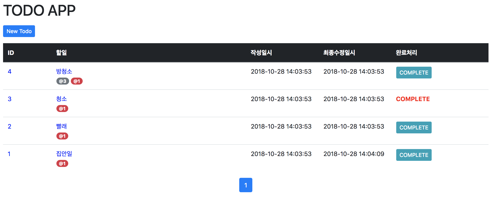

# Spring Boot Todo Application

[](https://travis-ci.org/akageun/spring-boot-todo-app)
[](https://coveralls.io/github/akageun/spring-boot-todo-app?branch=master)


이 프로젝트는 Spring Boot로 만들어진 Todo Application 입니다.



## 사용기술
- Jdk 1.8
- Maven 3
- Spring Boot
- Spring Boot JPA
- Thymeleaf 
- H2 Database
- Bootstrap
- Jquery
- lombok

## Features
- 할일을 페이징된 리스트로 조회할 수 있다.
- 할일 등록/수정
- 할일 참조기능(검색기능 포함)
- 할일 완료기능

## 실행방법
1. Clone
```
git clone https://github.com/akageun/spring-boot-todo-app.git
```

2. 빌드하기(실행 jar명은 변경 될 수 있습니다. [#17](https://github.com/akageun/spring-boot-todo-app/issues/17))
```
cd spring-boot-backend
(만약 test를 skip하고 싶으면 아래 명령어에 -DskipTests=true 를 붙이면 됨)
mvn package
java -jar target/todo-app-0.1.0.jar 
```

- 위 방법과 다른 실행 방법
```
mvn spring-boot:run
```

## TEST
```
mvn test
```


## API [#7](https://github.com/akageun/spring-boot-todo-app/issues/7)
 중간에 버전을 추가하여 api버전관리 할 수 있도록 함.
 
### 용어설명
| 이름 | 용어 | 
|:---:|:---------:|
| todoId|할일 번호 |
| statusCd|할일 상태값. |

### Method
* GET : 리소스 조회 합니다.
* POST : 리소스를 생성 합니다.
* PUT : 리소스를 수정 합니다.
* PATCH : 리소스 일부만 수정합니다.

### Http Status Code
* 200 Ok : 성공
* 201 Created : 신규 리소스 생성 성공
* 400 Bad Request : 요청이 부적절할 경우 사용하는 코드
* 404 Not Found : 없는 리소스 요청시 코드
* 405 Method Not Allowed : 지원하지 않은 Method 요청일 경우.
* 415 Unsupported Media Type : content-type 에러 코드
* 500 Server Error : 서버에러가 발생했을 때 사용하는 코드

[#API 전체문서 보기](./docs/API.md)

## 문제해결
###### 적정기술 선정
  - java 및 Spring Boot : 평소 자주 사용하는 기술로 생산성이 높아 선택함
  - UI(Bootstrap, Jquery) : 반응형 웹 등 UI 를 빠르게 만들 수 있어서 선택함.
    - 추후 vue + Bs4 로 front를 변경하고 싶음.
  - JPA : Mybatis 보다 생산성이 높아 빠르게 개발하기 위해 선택함.

###### 할일 관리
  - 할일 조회 [#11](https://github.com/akageun/spring-boot-todo-app/issues/11)
    - Pagination 을 위해 backend에서 다 계산하여 front로 전달해줌. [#14](https://github.com/akageun/spring-boot-todo-app/issues/14)
    - 참조된 할일까지 한번에 join하여 데이터를 가지고 오다보니, jpa에 양방향 조인에서 무한참조 현상 발생
      - **@JsonIgnoreProperties** 를 사용하여 해당 값을 가져올 때 무한참조 현상 수정
      - .toString() 시에도 같은현상이 발생되어 toString() 메소드 override 함.
```java
@Override
public String toString() {
    return ToStringBuilder.reflectionToString(this, ToStringStyle.MULTI_LINE_STYLE);
}
```      
  - 할일 등록 및 수정 [#8](https://github.com/akageun/spring-boot-todo-app/issues/8) [#9](https://github.com/akageun/spring-boot-todo-app/issues/9)
    - 큰 이슈 없이 CRU 를 생성함.
    - 등록시에는 '작성일', '최종수정일' 두개의 날자를 입력하지만 수정시에는 '최종수정일'만 입력되도록 개발
    - **@CreationTimestamp** 와 **@UpdateTimestamp** 를 사용함.
    - 방어처리를 위해 '작성일'에는 'updatable = false' 옵션추가.
     
  - 할일 참조처리
    - 한개의 '할일'에 여러개의 '참조 할일' 을 추가/수정 할 수 있도록 테이블 정규화함.
    - 자기 자신을 참조 할 수 없도록 함(할일 완료처리시에 문제가 됨.)
    - 참조 할일 등록 방법
      - 등록된 할일 고유번호를 입력하는 등 여러가지 방안 고민
      - select2 라이브러리를 사용하여, 검색하여 손쉽게 등록할 수 있도록 개발.
        - select2 자체에서 중복등록 등 막아줌.
      - 관련해서 검색 api 추가. ([#16](https://github.com/akageun/spring-boot-todo-app/issues/16))
      
    
  - 할일 완료처리 [#12](https://github.com/akageun/spring-boot-todo-app/issues/12)
    - 할일에 statusCd를 추가함
      - 미처리 상태와 완료 상태를 구분하기 위해 추가.
      - 확장성을 고려하여 '처리 완료 Y/N' 등이 아닌 enum 형태로 statusCd 를 생성
      - column 은 단순 문자열로 하여, 실 환경 운영시 상태값 추가로 인해 매번 column 수정 작업 없도록 함.
      - 단, 지정된 statusCd 만 사용하기 위해 '**@TodoStatusCdValid**' 를 생성하여 사용함.
   
    - 완료처리 할려고 하는 할일을 참조한 할일이 있을 경우 완료처리 못하도록 막음
      - 참조 테이블에 '참조 할일 번호'로 index를 잡고 검색해함. 미처리 상태일 경우 완료처리 불가.
      
      
       
## TODO 
* [ ] QueryDSL 을 사용하여 dynamic query 기능 추가.
* [ ] 할일에 대한 상태값 추가. (진행중 등)
